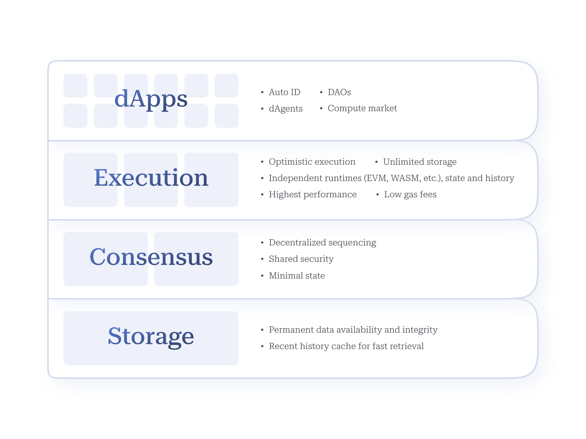

<figure><figcaption>
Autonomys AI3.0 Stack
</figcaption></figure>

* [_**dApp/Agent Layer**_](../../autonomys-vision/potential-applications.md)_**:**_ facilitating the development and deployment of super dApps (AI-powered dApps) and Autonomys Agents ([Auto ID](../../auto-suite/autoid/)-integrated on-chain agents) for verifiable digital interaction.
* [_**Execution/Domain Layer**_](../../autonomys-network/decoupled-execution/)_**:**_ secure, scalable distributed compute for AI training, inference and agentic workflows.
* [_**Consensus Layer**_](../../autonomys-network/consensus/)_**:**_ verifiable decentralized sequencing and transaction validation for shared security.
* [_**Storage Layer**_](../../autonomys-network/network-architecture.md)_**:**_ distributed storage ensures data integrity and permanent availability—crucial for storing vast amounts of AI data.

Utilizing the [Subspace Protocol](broken-reference), with its innovative [Proof-of-Archival-Storage (PoAS)](../../autonomys-network/consensus/proof-of-archival-storage/) consensus mechanism, our decentralized physical infrastructure network (DePIN) incentivizes active participation through the permissionless contribution of any amount of storage space or compute, or staking of any amount of tokens, permitting unprecedented accessibility.
