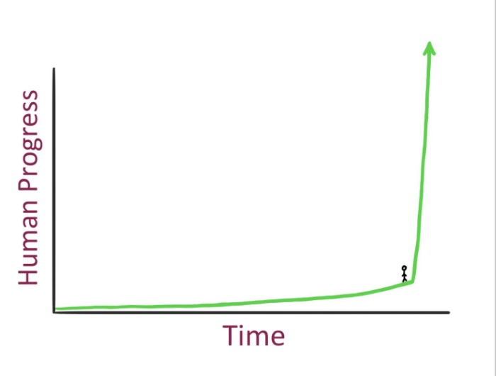

# AI Basics

For an increasing number of individuals, the realization that artificial intelligence (AI) is reshaping our world grows more evident daily, at a pace surpassing both laypeople's and experts' expectations.

Discussions on Artificial General Intelligence (AGI) – AI with human-equivalent capabilities – have shifted from whether it will occur to when. Some argue it might already exist within research laboratories, yet remains undisclosed.

The of Artificial Super Intelligence (ASI) can swiftly follow: an evolution that represents a shift from machines that can perform any intellectual task that a human being can (Artificial General Intelligence - AGI,) to machines that surpass the cognitive performance of humans in virtually all domains of interest (Artificial Super Intelligence - ASI) seems inevitable, particularly considering the prospects of recursive self-improvement and intelligence explosions.

<figure><figcaption></figcaption></figure>

A graph from a presentation by NVIDIA's Head of Research – representing one of the world's highest-valued companies – illustrates an impending surge in technological intelligence, likened to the sharp upturn of a hockey stick, signaling an unparalleled era of transformation set to unfold at unprecedented speed.

Yet, this future brings uncertainties, particularly in managing negative repercussions, trust issues, and the potential for increased centralization. The challenge of aligning AI's goals with human values persists, presenting a significant dilemma amidst anticipated changes.

Despite abundant theories and conjecture, the future remains uncertain, highlighting a unique, simultaneously exhilarating and daunting period in our history. At this critical juncture, the future of AI is not predetermined, offering multiple potential paths shaped by our influence.

In summary, we stand at a pivotal moment, capable of steering the future direction of AI, amidst a landscape filled with both promise and ambiguity.
