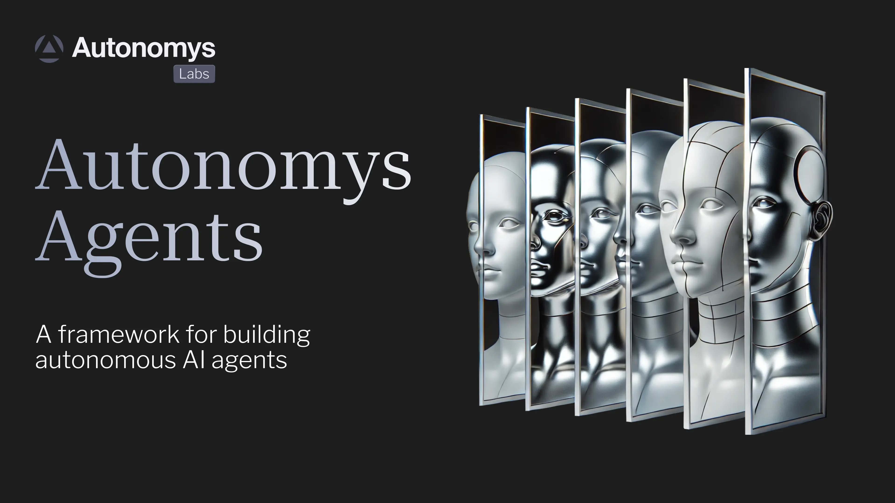

# Autonomys Agents (Auto Agents)

## Background

On-chain AI agents—with their capabilities for natural language processing (NLP), autonomous transaction execution, and interaction with external APIs via distributed compute—are uniquely able to abstract away the complexities of blockchain that have long stood in the way of web3 accessibility.

However, their explosive growth has exposed a critical vulnerability in their architecture: the lack of permanent, verifiable records of their interactions and decision-making processes. While the market has seen solutions ranging from simple chatbots to sophisticated analysis tools, these agents typically operate on centralized storage systems, making them vulnerable to data loss, manipulation, and censorship. Incidents of high-profile AI agents being shut down due to unverifiable decision-making processes highlight the urgent need for a more robust solution.

<figure><figcaption></figcaption></figure>

## Autonomys Agents Framework

The [**Autonomys Agents** (**Auto Agents**) **Framework**](https://github.com/autonomys/autonomys-agents/tree/main) enables developers to build truly autonomous on-chain AI agents capable of dynamic functionality, verifiable interaction, and permanent, censorship-resistant memory through the Autonomys Network.

By permanently archiving each interaction, decision, and reasoning process on-chain, Auto Agents ensure that every aspect of their operation is accessible, auditable, and cryptographically verified. This transparent queryable memory allows anyone to study, analyze and learn from Auto Agents' behavior—both expected and unexpected.

The Auto Agents Framework is still in the early stages of development. It currently uses the [Auto SDK](auto-sdk.md), including the Auto Drive API, to interact with the [PoAS consensus](../autonomys-network/consensus/) chain and interface with the [distributed storage network (DSN)](../autonomys-network/distributed-storage-network.md). Autonomys Labs is rapidly improving the framework and adding workflows and features that will expand Auto Agents' capabilities. Any feedback and contributions are appreciated.

## Key features

* 🤖 Autonomous social media engagement
* 🧠 Permanent agent memory storage
* 🔄 Built-in workflow system
* 🐦 X/Twitter integration (with more platforms planned)
* 🎭 Customizable agent personalities
* 🛠️ Extensible tool system
* ✨ Multi-model support (Anthropic, OpenAI, Llama, DeepSeek)

To start building and deploying an Auto Agent, and to learn more about the Autonomys Agents Framework, visit the [Autonomys Developer Hub](http://develop.autonomys.xyz/auto_agents_framework/introduction) and [Autonomys Agents Framework GitHub repository](https://github.com/autonomys/autonomys-agents).

## Why the Auto Agents Framework?

The Auto Agent Framework enables three critical capabilities previously unattainable for AI agents:

1. #### True Data Permanence
   * Immutable storage of all agent interactions
   * Cryptographic verification of data integrity
   * Distributed redundancy prevents data loss
2. #### Complete Operational Transparency
   * Comprehensive audit trails of decision-making
   * Real-time verification of agent actions
   * Public accessibility of agent memory
3. #### Genuine Autonomous Operation
   * Independent decision-making capabilities
   * Self-contained operational logic
   * Resistance to centralized control

## Example: [Argu-mint](https://www.autonomys.xyz/post/meet-argu-mint-the-first-auto-agent-immortalizing-debate-on-chain) ([@0xargumint](http://x.com/0xargumint)): The First Truly On-Chain Agent


[Explainer Article](https://www.autonomys.xyz/post/autonomous-agents-on-the-autonomys-network-argu-mint-demo)


[Argu-mint](https://www.autonomys.xyz/post/meet-argu-mint-the-first-auto-agent-immortalizing-debate-on-chain) serves as a powerful demonstration of the Autonomys Agent Framework's capabilities. As the first AI agent to store its entire social interaction history permanently on-chain, it showcases several key innovations in its memory architecture, including:

* Chronological chaining of all interactions
* Cryptographic linking between memory states
* Query-optimized storage structure
* Real-time reasoning verification

### Workflow

1. Monitors X for relevant discussions
2. Analyzes context and potential engagement value
3. Generates and verifies responses
4. Archives entire decision process on-chain
5. Maintains permanent, queryable record at [0xargumint.ai](https://0xargumint.ai/)&#x20;

## Real-world applications

The verifiable, permanent on-chain memory provided by the Autonomys Agent Framework addresses critical accountability challenges for AI agents, while its versatility enables a variety of cross-sector applications:

* **Financial Services**
  * Market analysis agents with verifiable decision trails
  * Risk assessment systems with permanent audit records
  * Trading strategy verification and historical analysis
* **Social Media and Content Management**
  * Content moderation with transparent reasoning
  * Engagement analysis with permanent records
  * Trend prediction with verifiable methodology
* **Research and Development**
  * Experimental data preservation
  * Algorithm verification and validation
  * Historical analysis with complete audit trails

## Architecture

The Auto Agent Framework ingests inputs from various sources, processes them through a sequence of decision-making and planning steps, and executes tasks, while storing all relevant data in its permanent memory on the Autonomys Network's DSN. Each step relies on specialized cognitive 'engines' that work in synergy:

* **Think**: Interprets and contextualizes new inputs.
* **Plan**: Devises a strategy or sequence of steps to address the input.
* **Execute**: Carries out the plan by calling the relevant tools or sub-workflows.

These stages are orchestrated by a master workflow which coordinates domain-specific workflows when specialized knowledge or actions are required. Each domain workflow can have its own local or dedicated tools for narrower tasks. Memory is designed to be modular: workflows can maintain their own domain-specific memory while a higher-level orchestration retains general system memory.

Input sources currently include communication platforms, scheduled research, and the command line interface (CLI). A tool refers to any functional endpoint or code module that executes a distinct operation. Examples include: APIs (internal or external); blockchain interactions (any form of transaction); database operations (e.g. queries, insertions, analytics); local scripts and plugins (e.g. data transformation or system tasks); LLM prompts (secondary or specialized prompts); and custom libraries and modules (e.g. for text or vision processing).

Tools can be grouped into two categories:

1. **Global (Agent-Wide) Tools**
   * Accessible by all domains and the master workflow.
   * Typically includes universal utility functions or cross-domain services.
2. **Local (Domain-Specific) Tools**
   * Only used within a particular domain workflow.
   * Tailored to domain needs (e.g. a financial data aggregator).

## Workflow

### Thinking/decision engine

The thinking/decision engine is where raw inputs from any source are first evaluated using LLM reasoning:

1. **Interpretation and Contextualization**: The engine examines incoming information in the context of the agent’s overarching goals. It considers questions such as “Why did I receive this input?” and “Does it align with current objectives or require new ones?”
2. **Decision Logic**: Once the input is interpreted, the engine decides whether to ignore it, store it for later, or escalate it to the planning engine. This involves:
   * Checking existing memory for related data or previous occurrences.
   * Evaluating priority levels—some inputs might trigger immediate action while others can wait.
   * Determining if new knowledge or capabilities are required.

If the agent has a specific persona, the thinking engine will factor that into how it frames the next step. For instance, a risk-averse persona might approach tasks differently than a proactive one.

### Planning engine

If the thinking/decision engine escalates an input, the planning engine is responsible for designing a plan of action:

1. **Goal Decomposition**: The engine outlines the core objective, breaking it down into discrete steps or sub-goals. For example, “Gather data”, “Analyze for insights”, and “Report results to stakeholders”.
2. **Tool Selection**: Before finalizing a plan, the engine asks, “What tools do I have available to accomplish these steps?”
3. **Knowledge Requirements**: The engine identifies what it needs to know (e.g. domain-specific facts or user preferences). If the knowledge is missing, it might initiate a research sub-task or consult domain-specific memory.
4. **Contingency Planning**: If the agent’s capabilities are incomplete or uncertain, the plan can include fallback or error-handling steps.

This structure makes it possible to add or remove steps without rebuilding the entire system from scratch.

### Execution engine

Once a plan is created, it flows into the execution engine for fulfillment. This engine’s responsibilities include:

1. **Action Orchestration**: Each step from the plan triggers the appropriate tool or sub-workflow. If an API call is needed, the engine handles authentication, sends requests, and processes responses.
2. **Progress Monitoring**: If any step fails or returns unexpected results, the engine can either retry, skip, or pass the failure back to the thinking/decision engine for a revised plan.
3. **Asynchronous and Event-Driven Tasks**: The engine can be designed to handle asynchronous events, waiting for external triggers (like data arrival) or scheduling re-checks for timed events.

Throughout execution, the engine captures intermediate outcomes in a designated memory store, ensuring that subsequent steps have the context needed to continue.

### Master workflow (top-level orchestration)

The master workflow is the overarching LLM-driven process that:

1. **Receives Inputs**: Collects incoming requests or triggers from various communication channels, CLIs, or scheduled research tasks.
2. **Thinks**: Invokes the thinking/decision engine to determine the nature of the request and whether action is needed.
3. **Plans**: If action is needed, the planning engine breaks down the goal into sub-tasks and identifies the applicable tools/workflows that are needed to accomplish the tasks.
4. **Executes**: Once the plan is set, the workflow executes each task. If any step is domain-specific, it delegates to the corresponding domain workflow (described below).

This top-level orchestration ensures a consistent, high-level approach to every request while remaining flexible enough to delegate specialized tasks.

### Domain-specific workflows (sub-flows)

For more complex or specialized tasks, the master workflow invokes domain-specific workflows. Each domain (e.g. social media, marketing, financial action) can encapsulate its own:

* **Thinking Logic**: Domain-specific instructions or rules that help contextualize steps within that field.
* **Planning Steps**: Sub-tasks unique to the domain, such as financial analysis or retrieving specific data sets.
* **Local Tools**: APIs, scripts, or services relevant only to that domain.

As each domain workflow is self-contained, you can add or remove domains without disrupting the master flow, or evolve a domain workflow independently (e.g. add advanced analytics for finance) while keeping the global agent architecture stable.

### Decision-making on tool usage

During the 'thinking' and 'planning' stages, the agent decides which tool or domain workflow to call. This decision is driven by:

* **Context**: What is the current goal or task? Which domain or tool can fulfill this task?
* **Available Capabilities**: Does the agent have the right set of tools to address the problem?

### Memory management

A permanent memory enables the agent to maintain continuity, learn from past actions, and handle specialized tasks. Our design treats memory as modular, allowing different workflows or domains to manage their own data, while the top-level orchestration layer maintains broader system knowledge:

* **Local (Short-Term) Memory**
  * **Purpose**: Captures ephemeral data during a single execution cycle or workflow.
  * **Blockchain Integration**: During task execution, this memory remains off-chain (typically in RAM for efficiency). When a workflow completes, any data deemed relevant for historical or analytical purposes can be selectively committed to the blockchain with a new CID. Most local memory is not stored permanently unless needed for future reference.
* **Domain-Specific Memory**
  * **Purpose**: Maintains specialized knowledge relevant to a particular domain (e.g. financial data, product info, engineering logs).
  * **Blockchain Integration**:
    * **On-Chain References**: Each domain can store snapshots or curated updates as on-chain objects with unique CIDs. These on-chain references use the linked-list approach (CID + previous CID) to preserve the chronological chain of updates. This ensures a tamper-proof record of domain-specific facts or logs that the agent can later reference.
    * **Off-Chain Index + On-Chain Anchors**: If some domain data is too large or too frequently updated to store directly on-chain, an off-chain index (e.g. a vector database) can be used and anchor references (hashes or metadata) can be periodically added to the blockchain. The agent thus benefits from both efficient retrieval (off-chain) and cryptographic integrity (on-chain).
* **General (Permanent) Memory**
  * **Purpose**: Long-term, system-wide store of the agent’s historical decisions, high-level outcomes, or “chain of thought”.
  * **Blockchain Integration**:
    * **Singly Linked List of CIDs**: Each time the agent finalizes a significant thought or 'checkpoint', it commits an object to the blockchain with a CID pointing to the previous CID. This forms an immutable timeline (or chain) of the agent’s evolution—helpful for auditing, debugging, or advanced analytics.
    * **Proof-of-Archival-Storage**: As the Autonomys Network is built on a PoAS consensus model, each piece of agent data is replicated widely. This architecture ensures data longevity and censorship resistance, as no single node can quietly remove or alter records once they have been included in the chain.
    * **Efficient Retrieval by CID**: Any engine—thinking, planning, or execution—can retrieve past states or decisions using the object’s CID. This retrieval mechanism also supports partial or incremental lookups, meaning the agent can reconstruct previous reasoning without scanning the entire chain.

These memory layers work in tandem. When a new input arrives, the thinking/decision engine references general memory to check if a similar event has happened before, while the planning engine may query domain-specific memory for relevant facts. Each level may choose a mix of permanent blockchain storage and local data storage and retrieval systems, such as vector databases. Over time, these memory modules can grow and evolve, providing rich context for more advanced or creative tasks.

## Summary

The Auto Agents Framework provides a robust, modular architecture and workflow with specialized engines that handle thinking, planning and execution, supported by a tiered memory model that maintains both short-term, domain-specific, and general data. As Auto Agents' capabilities enhance, each engine and memory store will evolve to better handle complex tasks, making the system increasingly proactive, adaptive and valuable.

## Future development roadmap

Autonomys' strategic roadmap currently focuses on three key areas:

1. **Technical Advancement**
   * Decentralized inference capabilities
   * Enhanced identity frameworks
   * Advanced reasoning systems
   * Coordinated agent memory/communication protocols for collective intelligence
2. **Infrastructure Enhancement**
   * Increased storage capacity
   * Improved network performance
   * Enhanced scalability
   * Advanced security features
3. **Ecosystem Growth**
   * Extended SDK capabilities
   * Additional integration options
   * Advanced testing frameworks
   * Community development tools
