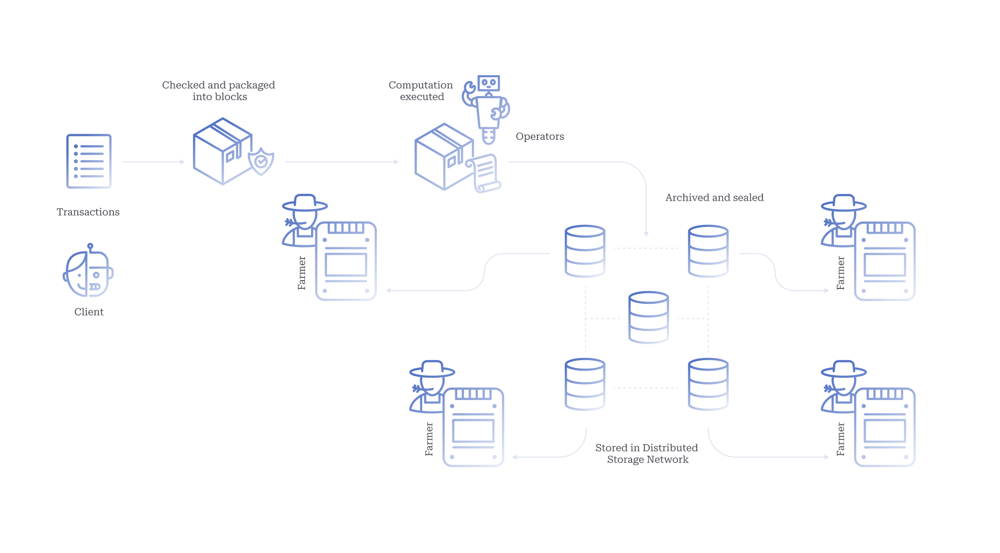

# Introduction

At its core, the Autonomys Network implements [Subspace](https://cdn.prod.website-files.com/61526a2af87a54e565b0ae92/617759c00edd0e3bd279aa29_Subspace_%20A%20solution%20to%20the%20farmer's%20dilemma.pdf), a novel storage-based consensus protocol that separates transaction ordering from execution. The Subspace Protocol was designed from the ground up to enable an open and inclusive Internet by:

* Providing an energy-efficient and eco-friendly alternative to proof-of-work (PoW), while still allowing for mass participation by ordinary users.
* Creating an incentive-compatible permissionless network that encourages and maintains decentralization over the long term.
* Scaling network storage and compute capacity proportional to the number of node operators, without sacrificing decentralization or security.
* Connecting and enabling interoperability between existing networks.

Achieving this vision required an alternative to both resource-intensive PoW mining and permissioned proof-of-stake (PoS)—a cryptographic proof system based on an underlying resource that is already massively distributed and which does not lend itself to special-purpose hardware. Enter [_proof-of-capacity_ (PoC)](#user-content-fn-1)[^1], which replaces compute-intensive mining with storage-intensive farming, under the maxim of one-disk-one-vote. Disk-based consensus is an obvious solution as storage hardware consumes negligible electricity, exists in abundance across end-user devices, and has long been commoditized.

Subspace uses a longest-chain PoC consensus mechanism based on solid-state drive (SSD) storage. Adhering to Nakamoto’s vision, the blockchain is permissionless but secure, with respect to safety and liveness, as long as honest farmers collectively dedicate more storage than any cooperating group of attacker nodes. In essence, Subspace follows the Ethereum model of a fully programmable, account-based blockchain, which periodically commits to the state of all accounts within the block header.

Contrary to many existing PoC protocol designs, Subspace addresses a critical mechanism design challenge—[the farmer’s dilemma](https://cdn.prod.website-files.com/61526a2af87a54e565b0ae92/617759c00edd0e3bd279aa29_Subspace_%20A%20solution%20to%20the%20farmer's%20dilemma.pdf)—which poses a significant threat to the decentralization and security of PoC blockchains. Rational farmers are incentivized to allocate all their available storage towards consensus, neglecting the maintenance of [chain state and history](https://bitslog.com/2014/11/03/proof-of-local-blockchain-storage/). In the farmer’s dilemma, this behavior leads to farmers effectively becoming light clients, degrading network security and decentralization. The trend ultimately risks consolidation into large farming pools, centralizing control around pool operators, and reducing the network’s resilience against malicious actors. The farmer’s dilemma also exacerbates the [verifier’s dilemma](https://dx.doi.org/10.1145/2810103.2813659) by raising the opportunity cost of verification. If full nodes do not store the chain history, new nodes must instead rely on altruistic archival nodes or third-party data stores for initial synchronization, resulting in a more centralized network.

Subspace circumvents the farmer’s dilemma without sacrificing network security or decentralization as follows:

* _To prevent farmers from discarding chain history:_ we construct a novel PoC consensus protocol, based on proofs of storage of the blockchain’s history (Proof-of-Archival-Storage), where each farmer stores as many provably unique partial replicas of the chain history as their disk space allows.
* _To ensure consensus retains the fairness of one-disk-one-vote:_ we make the plotting process more computationally intensive than [Hellman’s time-memory tradeoff](https://ia.cr/2017/893), meaning that augmenting or replacing storage with computation is economically irrational for farmers.
* _To ensure chain history remains available:_ farmers form a decentralized storage network, which allows chain history to remain fully-recoverable, load-balanced, and efficiently retrievable.
* _To relieve farmers of the burden of maintaining the whole state and performing redundant computation:_ we apply the classic distributed-systems technique of decoupling consensus and computation. Farmers are then solely responsible for ordering transactions, while a separate class of operator nodes maintains the state and computes the state transitions for each new block.
* _To ensure operators (executors) remain accountable for their actions:_ we employ a system of staked deposits, verifiable computation, and non-interactive fraud proofs.

<figure><figcaption>
Blockchain Data Flow
</figcaption></figure>

## Contents

This section provides a comprehensive overview of the Autonomys Network, Subspace Protocol, and $AI3:

1. [**Introduction**](introduction.md)
2. [**Terminology**](terminology.md)
3. [**Architecture**](architecture-overview.md)
4. [**Advancing Blockchain**](advancing-blockchain.md)
5. [**Nodes**](network-architecture.md)
6. [**Subspace Protocol (PoAS Consensus)**](consensus/)
   1. [Genesis](consensus/genesis.md)
   2. [Data Flow](consensus/data-flow.md)
   3. [Proof-of-Archival-Storage (PoAS)](consensus/proof-of-archival-storage/)
   4. [Proof-of-Time (PoT)](consensus/proof-of-time.md)
   5. [Security](consensus/security.md)
7. [**Distributed Storage Network (DSN)**](distributed-storage-network.md)
8. [**Decoupled Execution (DecEx)**](decoupled-execution/)
   1. [Domains](decoupled-execution/domains/)
   2. [Staking](decoupled-execution/staking.md)
9. [**Networking Protocols**](networking-protocols.md)
10. [**$AI3 Rewards & Fees**](rewards-and-fees/)
11. [**Scalability**](scalability.md)

## Learn more

***

* [Subspace: A Solution to the Farmer’s Dilemma](https://cdn.prod.website-files.com/61526a2af87a54e565b0ae92/617759c00edd0e3bd279aa29_Subspace_%20A%20solution%20to%20the%20farmer's%20dilemma.pdf) (Whitepaper, 2021)
* [Subspace Network Reference Implementation](https://github.com/autonomys/subspace)
* [Autonomys: Foundation Layer for AI3.0](https://cdn.prod.website-files.com/66d7181179fbc331d39e9df0/6734a4bf4a74c3c5c6b01d34_autonomys_whitepaper.pdf) (Whitepaper, 2024)
* [Autonomys: Foundation Layer for AI3.0](https://autonomys-public-assets.s3.us-east-1.amazonaws.com/autonomys-lightpaper.pdf) (Litepaper, 2024)

[^1]: We use proof-of-capacity as an umbrella term encompassing proof-of space, proof-of-storage, proof-of-replication, proof-of-space-time, proof-of retrievability, and other storage-based protocols.
