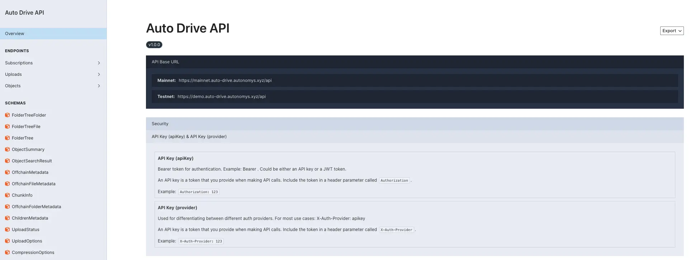

# Autonomys Network

## The Subspace Protocol

The Autonomys Network is an instance of the Subspace protocol which has a number of custom domains that deliver products such as [Auto ID](autoid/) and [AutoCo](autoco/) among others. Because Auto is built on domains, its design and implementation can be easily iterated on without hassle, unlike the core Subspace protocol.

<figure><figcaption></figcaption></figure>

The Subspace protocol is a Layer 1 blockchain that offers us a number of exciting and desirable properties. It has a novel Proof of Archival Storage consensus, provides limitless scalability, is eco-friendly compared to other chains and is designed to encourage decentralization from the inside out. It addresses all three sides of the [blockchain trilemma](../additional-learning/technology-basics/the-blockchain-trilemma.md) which is a concept that suggests it's challenging to achieve three key properties in a blockchain network simultaneously: decentralization, security, and scalability. Decentralization means the network isn't controlled by a central authority, security refers to the network's resistance to attacks, and scalability is the network's ability to handle a large number of transactions.

Subspace addresses the blockchain trilemma through its innovative design and technologies. Here's how:

1. **Decentralization**: Subspace ensures decentralization by allowing anyone to participate in the network without needing expensive or specialized hardware. This inclusivity means more people can join and contribute to the network's operation, helping avoid centralization where only a few powerful entities control the network. For a deeper understanding of our approach to decentralization, you might explore the [nodes](https://subnomicon.subspace.network/docs/network/nodes) and [network protocols](https://subnomicon.subspace.network/docs/network/network\_protocols) sections of The Subnomicon.
2. **Security**: The security in Subspace is maintained through a novel consensus mechanism that is robust against various types of attacks. This mechanism is designed to ensure that all transactions and operations on the network are verified and legitimate, making it difficult for malicious actors to manipulate the network. The Subnomicon [consensus overview](https://subnomicon.subspace.network/docs/consensus/overview), [genesis](https://subnomicon.subspace.network/docs/consensus/genesis), and [security](https://subnomicon.subspace.network/docs/consensus/security) pages provide a comprehensive look at the mechanisms the Subspace protocol employs to maintain high security.
3. **Scalability**: Subspace addresses scalability challenges by implementing efficient data storage and retrieval systems, allowing it to process and store large amounts of data without significant performance degradation. This capability is crucial for handling the growing volume of transactions as the network expands. This [data flow](https://subnomicon.subspace.network/docs/consensus/data\_flow) article will give you more insight into how Subspace manages data efficiently.

Subspace's approach involves a combination of advanced cryptographic techniques, a novel consensus algorithm, and a unique data storage system. These components work together to ensure that the network remains decentralized, secure, and scalable. For example, [cryptographic primitives](https://subnomicon.subspace.network/docs/consensus/consensus/crypto\_primitives/) enhance security, while the [archiving system](https://subnomicon.subspace.network/docs/consensus/consensus/archiving/) aids in scalability by efficiently managing blockchain data.

In summary, Subspace's solution to the blockchain trilemma involves a balanced approach that doesn't sacrifice one property for another. By innovating in consensus mechanisms, data management, and network participation, the protocol aims to provide a blockchain platform that is decentralized, secure, and scalable. For those interested in the intricate details of how these solutions are implemented, the provided links to The Subnomicon serve as a gateway to a more in-depth analysis of Subspace's technologies and methodologies.
