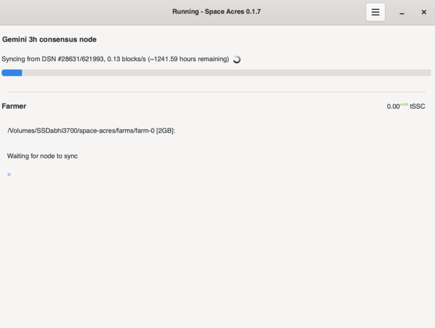

# Space Acres

**Running a blockchain node can be difficult**

One major barrier to the widespread adoption of blockchain and decentralized technologies has been the technical expertise required for participation. Running node software from the command line is a daunting task for most average users. This accessibility hurdle threatens to limit blockchain ecosystems to a small cluster of highly technical enthusiasts.

**Enter Space Acres**

Space Acres offers a solution by abstracting away the complexities through an intuitive graphical interface (GUI). By seamlessly handling the backend node operations, Space Acres allows users to contribute their unused storage space to secure the Autonomy Network — we call this farming on the network.

Space Acres provides several key features to simplify the farming process:

**Configuration**: Users can easily configure their reward address, node location, multiple farms, and P2P ports through the user-friendly interface.

**Node Sync**: The node synchronization process is displayed with progress, speed, and estimated time remaining (ETA), keeping users informed about the status.

**Plotting and Farming**: AutoPeer displays the plotting/farming piece cache progress, replotting progress, and calculates the speed, giving users visibility into their farming operations.

**Auditing and Proving**: Performance indicators for farmer auditing and proving are provided, allowing users to monitor their contribution to the network.

**Sector State Visualization**: The state of farmer sectors is visually represented, providing a clear overview of their storage contribution.

By participating, users not only secure the network's infrastructure but also earn AI3, the native digital currency of the Autonomy Network. This incentivization model scales rewards to contributors depending on their storage offerings, fostering a scalable storage solution resistant to centralized points of failure.

Upon joining, users are granted an Auto ID, which serves as their unique identifier for a human or AI within the network. This ID also facilitates their ability to engage in staking activities, where participants can lock in their holdings of AI3 to earn yields. Staking not only rewards users for their contribution to network liquidity but also plays a crucial role in securing the network and ensuring its efficient operation. Through this innovative approach, Space Acres offers a comprehensive platform where users can not only contribute to decentralized data storage but also participate in the financial ecosystem of the Autonomy Network.\
\
To learn more and install Space Acres, visit our [farming documentation](https://docs.autonomys.xyz/docs/farming-&-staking/farming/space-acres/space-acres-install).&#x20;

<figure><figcaption></figcaption></figure>

<figure><figcaption></figcaption></figure>
