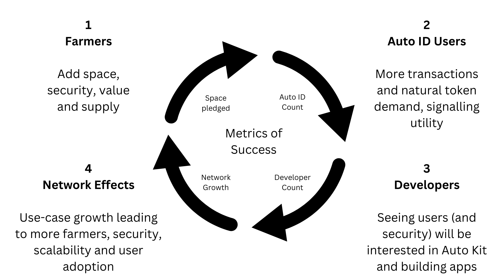

# Farm to Earn AI3

Let's delve into the concept of a "farmer" within the Autonomys Network ecosystem, a blockchain environment powered by the Subspace protocol and designed for efficiency and sustainability. A farmer, in this context, is not tending to crops, but rather, to digital fields of data. By offering their computer's spare storage space, they play a pivotal role in maintaining and securing the network.

The essence of farming revolves around the utilization of unused storage on farmers' computers to store pieces of the blockchain. This is not merely a passive activity; it requires active participation and maintenance to ensure data integrity and availability. In return for their contributions, farmers are rewarded with AI3, a form of digital currency intrinsic to the Autonomys ecosystem. A farmer's space can be pledged to the network through two routes:

1. **The Advanced CLI** - a reference implementation of the Subspace client software. Split between a node and farmer it provides ultimate flexibility and composability.
2. **Space Acres** - an AI assisted path to farming. Offering a rich GUI and designed to be the simplest way to get started with minimal to no technical or Web3 knowledge required.

Both paths have their audiences but they are common in that they use Auto ID to identify the farmer. The motivations for individuals to engage in farming are multifaceted. Primarily, it offers a means to earn AI3, which can be seen as a form of passive income. Beyond financial incentives, farmers contribute to the decentralization and robustness of the network, fostering a community-driven approach to data storage and security. This participation not only strengthens the network but also aligns with broader ideals of decentralization and privacy in the digital age by providing key infrastructure for the Autonomys stack and products.

<figure><figcaption>
The AI3 growth flywheel
</figcaption></figure>

Earning AI3 through farming is an enticing prospect for many. AI3 serves multiple purposes within the Autonomys ecosystem; it can be used for transactions, governance, and as a stake in securing the network further. The versatility of AI3 extends beyond the core protocol, as it holds potential for exchange into other cryptocurrencies or fiat currencies, thereby offering liquidity and wider financial opportunities.

Farmers are integral to the ecosystem's health, ensuring its operation and security. Their role is akin to that of miners in traditional proof-of-work blockchain systems, but with a focus on sustainability and efficiency. The Subspace protocol model emphasizes a low barrier to entry, allowing individuals with unused SSD storage space to participate without the need for specialized hardware, making farming more accessible and environmentally friendly.

The broader Autonomys ecosystem is designed to support a variety of applications, from decentralized finance (Auto Fi) to collaboration at massive scale (AutoCo), all anchored by the contributions of farmers who provide consensus across all product domains. This symbiotic relationship ensures the longevity and resilience of the network, as each farmer's contribution reinforces the collective infrastructure. One of the core features we inherit from the Subspace protocol is providing calm, comfort and resilience to people by making them stakeholders in a bright future secured by the network. The more secure the network, the better the future.

In summary, farming on the Autonomys Network represents a confluence of technological innovation, community participation, and economic incentive. Through their efforts, farmers earn AI3, contributing to a decentralized, robust network while gaining the opportunity to be part of a new digital economy. The allure of earning AI3 lies not just in the potential financial rewards, but also in the participation in a forward-thinking, community-driven ecosystem at the convergence of blockchain and AI.

For a more detailed exploration of farming, including technical specifications and guidelines, visiting the [official documentation](https://docs.subspace.network/), the [Subnomicon](https://subnomicon.subspace.network/) and [community forums](https://forum.subspace.network/) is highly recommended. These resources offer a wealth of information for both novice and experienced participants, providing insights into the mechanics of farming, the utility of AI3, and the broader vision of the Autonomys project.