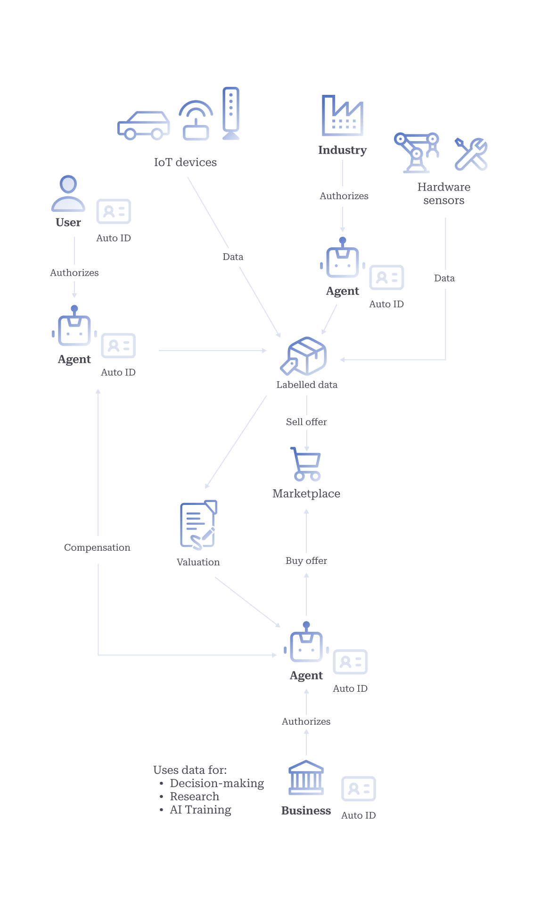
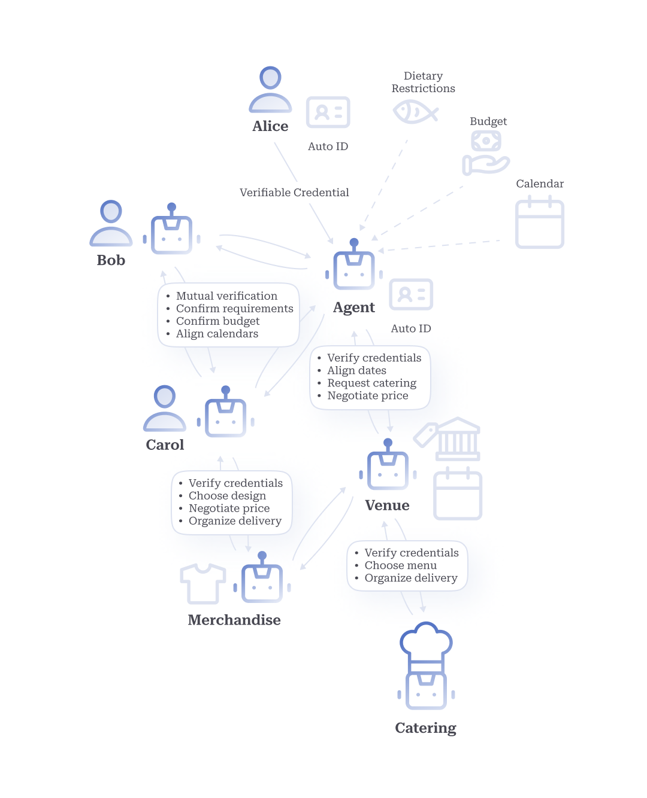

# Use-Cases

## A. Future-Proofing Storage for AI3.0

The advent of AI3.0 brings with it an unprecedented demand for vast, permanent decentralized storage capable of rapid data retrieval. As AI systems become more sophisticated and personalized, they require access to enormous datasets for training, fine-tuning, and real-time decision-making. Traditional centralized storage systems are ill-equipped to handle the scalability, security and accessibility requirements of this new paradigm.

Decentralized storage solutions offer several key advantages: ensuring data integrity and availability through redundancy; mitigating single points of failure; and allowing for more equitable distribution of resources. Moreover, the permanence of data storage is crucial for maintaining historical records, enabling long-term learning, and supporting account ability in AI decision-making processes. Rapid data retrieval is equally essential, as AI3.0 agents must be able to access relevant information swiftly to provide real-time responses and make informed decisions. This combination of vast capacity, permanence, decentralization, and speed is fundamental to realizing the full potential of AI3.0—where personalized Autonomys agents operate efficiently and verifiably at scale.

Autonomys addresses this growing demand via our super-fast, hyper-scalable, permanent [distributed storage network (DSN)](../subspace-protocol/network-architecture/distributed-storage-network.md) and content-delivery network (CDN) supported by multiple reliability layers; secured by PoAS consensus; and served by thousands of easy-to-setup nodes worldwide. At the core of the Autonomys economy is the concept of data sovereignty, enabled by our vast decentralized storage and systems for content contribution, provenance, and compensation. This revolutionary approach to understanding and managing personal information and intellectual property—where individuals retain control over their data assets and can opt to monetize them for AI training and optimization purposes—pioneers a novel economic model where humans may choose to share their personal data and receive fair compensation for the value their data provides in enhancing AI systems, rather than having their information exploited without remuneration, as is currently the case.

## B. Content Provenance and Data Sovereignty

Data sovereignty—the ability of individuals to control and maintain authority over their personal data and digital presence—is crucial in an era where sensitive data is frequently exploited by criminal actors and centralized entities. Data sovereignty cannot be achieved without a way to establish ownership and provenance of data in a verifiable way. Cryptographically linking digital content with its creator’s authenticated identity establishes an [immutable record of origin](http://usenix.org/event/fast09/tech/full%20papers/hasan/hasan.pdf) and subsequent modifications. Such a system empowers users with granular control over their data sharing preferences and provides a robust framework for verifying the authenticity of digital assets. It also offers a potential solution to the challenges posed by synthetic media, allowing recipients to discern between genuine and [artificially generated content](http://doi.org/10.22215/timreview/1282). Furthermore, as AI systems continue to evolve and generate increasingly sophisticated outputs, the ability to trace the lineage of training data and resultant content is becoming [increasingly important](https://arxiv.org/abs/2004.07213).

## C. Digital Identity

Autonomys’ secure protocol for the provision of decentralized digital identities—Autonomys Identity ([Auto ID](../autonomys-solutions/autoid/))—simultaneously allows for the authentication of AI-generated content and permissioning of agentic actions. Utilizing advanced cryptographic techniques, our robust self-sovereign identity (SSI) framework (deployed as a registered runtime on Autonomys’ domain layer) enables individuals to verify their identity without resorting to invasive biometric procedures. This foundational of digital trust is crucial for facilitating economic collaboration between humans and AI.

Key properties of the Auto ID system include:

* _Self-sovereignty:_ Users maintain complete control over their digital identity, with autonomy in information-sharing decisions via a combination of encryption, zero-knowledge and verifiable credentials.
* _Verifiability:_ Cryptographic proofs ensure the authenticity of claims without compromising personal information.
* _Universality:_ Auto IDs can be issued to any entity, human or artificial, enabling a common identity standard across the digital ecosystem.
* _Versatility:_ The Auto ID framework supports identity self-issuance, issuance by another entity, and co-issuance by multiple entities.
* _Interoperability:_ Auto ID is designed for seamless integration with existing identity systems such as [X.509](https://www.rfc-editor.org/rfc/rfc5280) and [Decentralized Identifiers](https://w3c.github.io/did-core/).

Auto ID plays a crucial role in establishing content provenance and ensuring data sovereignty. After obtaining an Auto ID, entities can digitally sign the content they produce, establishing a verifiable and tamper-proof record of authenticity and provenance for data, linked with their Auto ID. This is particularly important as the line between human-created and machine-generated content becomes increasingly blurred.

Cryptographically linking digital content with its creator’s authenticated identity establishes an immutable record of origin and subsequent modifications. Such a system empowers users with granular control over their data sharing preferences and provides a robust framework for verifying the authenticity of digital assets. It also offers a potential solution to the challenges posed by synthetic media, allowing recipients to discern between genuine and artificially generated content.

Autonomys also offers the ability to attach cryptographic identity claims to an Auto ID via verifiable credentials. For example, an individual may attach a verifiable credential to their Auto ID showing they have a valid diploma, and later utilize that claim when a diploma is required.

## D. Proof-of-Personhood

As we transition into an agent-integrated world, the ability to distinguish between humans and artificial entities becomes increasingly crucial. [Auto ID](../autonomys-solutions/autoid/) implements proof-of-personhood (PoP) via our composable, probabilistic PoP protocol [Auto Score](../autonomys-solutions/auto-sdk/auto-score.md). This system is designed to address the growing need for verifiable human identity in digital spaces, particularly in scenarios where AI agents and humans interact seamlessly. A strong PoP system is important in the AI3.0 era for several reasons:

* _Preventing AI Impersonation:_ As AI becomes more sophisticated, the risk of AI systems impersonating humans increases. A strong PoP system helps maintain the integrity of human-to-human interactions in digital spaces.
* _Ensuring Fair Resource Distribution:_ In a world where AI agents could potentially overwhelm systems, PoP ensures that resources and opportunities are fairly distributed among genuine human users.
* _Maintaining Democratic Processes:_ For online voting or governance systems, PoP is crucial to prevent manipulation by automated systems or sock puppet accounts.
* _Preserving Human-Centric Economies:_ As AI agents become more prevalent in economic systems, PoP helps maintain spaces for human economic activity and prevents AI from dominating marketplaces.
* _Ethical AI Development:_ PoP systems can help ensure that AI training data comes from verified human sources, promoting more ethical and representative AI development.

[Auto Score](../autonomys-solutions/auto-sdk/auto-score.md) leverages pre-existing evidence of personhood and zero-knowledge proofs (ZKPs) to generate privacy preserving, verifiable credentials that combine to offer a probabilistic proof-of-personhood score. Supporting ZKP-secured e-passport verification as a primary personhood factor, users need only scan the NFC chip in their passport and prove the correctness of the signature in a ZK-proof to achieve a high Auto Score. When combined with liveness checks, ZK-passport tech presents the strongest evidence of unique personhood and contributes to the highest possible Auto Score.

For applications that do not require government-grade identification, and users who do not possess or want to associate one with their Auto ID, Auto Score accepts alternative personhood factors. These include credit cards, social media accounts, and participation in decentralized networks. As a probabilistic PoP protocol, Auto Score functions by aggregating and evaluating various pieces of evidence supporting an entity’s claim to personhood. Each piece of evidence is assigned a weight based on its reliability and difficulty to forge. This evidence is shared utilizing ZKPs, allowing users to selectively share specific details, such as age of nationality, or prove their possession of credentials without revealing the underlying data to a verifier. Autonomys then calculates a composite score representing the probability of the user being a unique human using these weighted pieces of evidence. This score updates as users add or remove credentials, or as their digital interactions evolve, providing a dynamic measure of digital personhood.

Auto Score possesses the following characteristics:

* _Probabilisticity:_ Provides a nuanced measure of person hood rather than a binary determination, reflecting the complex nature of identity in the digital age.
* _Privacy-preservation:_ Leverages ZKPs and advanced cryptographic techniques to enable users to demonstrate their personhood without revealing sensitive personally identifiable information (PII), crucial in an era of increasing data breaches and privacy concerns.
* _Dynamism:_ An entity’s personhood probability score updates as they interact with the Autonomys ecosystem, reflecting their ongoing participation and contribution, and adapting to the evolving nature of digital identity.
* _Composability:_ Entities can build their digital identity incrementally by combining various types of evidence, allowing for a more comprehensive and nuanced representation of personhood.
* _Flexibility:_ Entities have full control over which components to include in their Autonomys PoP, empowering users to manage their digital identity according to their preferences and needs.
* _Interoperability:_ Integrates with current and emerging identity systems, and existing personhood evidence from web2 or web3 accounts, utilizing [TLS](https://tlsnotary.org/TLSNotary.pdf) [ZK](https://docsend.com/view/5wdg66beu7m95jf3)-[proofs](https://drive.google.com/file/d/1wmfdtIGPaN9uJBI1DHqN903tP9c%20aTG2/view) for rapid verification, improving user experience and bridging the gap between different digital ecosystems.

A composable, privacy-preserving PoP protocol is integral to the building of a novel digital identity system for an AI integrated world. This approach aims to provide a familiar user experience while maintaining absolute privacy and anonymity. Using multiple, pre-existing personhood factors allows Auto Score to circumvent issues of accessibility and centralization present in [current biometric PoP protocols](https://vitalik.eth.limo/general/2023/07/24/biometric.html), and ensures that every person has the ability to autonomously demonstrate their humanity unimpeded by borders and institutions. By approaching proof-of-personhood as a composable and probabilistic measure, Autonomys offers a more nuanced and adaptable solution to the challenge of verifying human identity in digital spaces. This system preserves individual privacy while providing sufficient assurance of personhood to enable trust in human-AI interactions and decentralized governance processes.

Auto ID and Auto Score represent a vital contribution to the development of the autonomous economy by providing it with an accessible, standardized framework for digital identity and data provenance. This will help facilitate verifiable human AI interaction, enable privacy-conscious verification, establish metrics of trust, and ensure traceability, promoting digital safety and inclusion in an increasingly AI-driven world.

## E. Decentralized Reputation Systems

As components of the Autonomys Network, Auto ID and Auto Score provide strong foundations on which to build a robust decentralized reputation system (DRS) that would allow participants to make anonymous yet verifiable assertions about their own [reputation](https://eprint.iacr.org/2020/761.pdf). An Auto ID-based DRS would offer users the ability to selectively share reputation claims, such as a credit score or developer reputation, in a way untraceable to their primary ID, while preserving Sybil-resistance and security against manipulation, including whitewashing and denial. Such a robust DRS would allow novel applications to be built on Autonomys—from peer-to-peer commerce and gig economy platforms to protocols for decentralized lending, crowdfunding, and collaborative research.

## F. Decentralized Learning and Proof-of-Training

Decentralized learning approaches aim to train machine learning models across multiple devices or nodes without relying on centralized data aggregation, thereby preserving privacy and data ownership. The Autonomys Network’s underlying Subspace Protocol is uniquely positioned to facilitate decentralized learning as it addresses several challenges that impede the practical implementation of decentralized AI storage/compute-sharing DePIN.

[Li (2023)](https://doi.org/10.48550/arXiv.2307.07066) identifies the significant state storage and bandwidth requirements of ML as the primary barriers to the mainstream usability of existing systems. The issues of state bloat and history growth beyond the capacity of any single node are addressed in our novel Proof-of-Archival Storage (PoAS) consensus mechanism and distributed storage network (DSN) design that stores only partial state and partial history on each individual node. The bandwidth required to support the movement of large amounts of training data and models through our network will be achieved—without hindering decentralization—following the implementation of our scalability roadmap.

Li also determines the ability to dynamically adjust work load based on demand for AI jobs in a way decoupled from transaction validation and consistent block time requirements to be a highly desirable feature of a deAI utility network. This is achievable through Autonomys’ decoupled execution (DecEx) framework, which gives domains—independent execution environments—the freedom to set any particular hardware requirements for nodes running execution on that domain, and only commit state transitions when there is demand for the domain’s resources. This architecture allows for efficient allocation of computational resources for decentralized learning tasks while maintaining the blockchain’s normal operation and other network activities.

The Proof-of-Training (AI-PoT—to distinguish it from proof-of-time (PoT)) protocol [described by Li](https://doi.org/10.48550/arXiv.2307.07066) could be adapted to function as a specialized domain on the Autonomys Network. The AI-PoT domain would manage the training processes, including task distribution, model validation, and reward allocation, while benefiting from the underlying security and scalability of the Autonomys Network. The operators of this domain would act as service providers, validators, and verifiers, with their roles and responsibilities defined by the Proof-of-Training protocol. The workflow described in [Li (2023)](https://doi.org/10.48550/arXiv.2307.07066) could be run on Autonomys’ domains framework as follows:

1. _Client Submission:_ A client submits an order containing model specifications, training data, and payment information via a transaction to the AI-PoT domain.
2. _Order Processing:_ The order transaction is picked into the domain mempool and eventually added to a bundle, which is then submitted to the consensus chain for farmers to include in a block. Once in a block, the order becomes available for service providers (a selected subset of staked domain operators) to fetch.
3. _Model Training:_ Service providers compete to train the best model based on the order specifications.
4. _Claim Submission:_ As service providers generate improved models, they submit claims containing model signatures to the network.
5. _Model Revelation:_ After the training period ends, operators reveal the full models corresponding to their submitted signatures.
6. _Validation Phase:_ Validators (the rest of the operators on the AI-PoT domain) evaluate the revealed models using the specified validation function and test data before broadcasting validation messages.
7. _Verification:_ Any honest operator on the domain can challenge any suspicious validations, adding an extra layer of security.
8. _Challenge Period:_ A time window allows for potential challenges to be resolved.
9. _Finalization:_ The network finalizes the results, determining the best model and associated rewards within the challenge period.
10. _Payment Distribution:_ As soon as the challenge period has passed, the payments are distributed to the winning service provider and validators.
11. _Result Retrieval:_ The client can retrieve the best model from the network.

The Autonomys Network’s native token could be utilized for staking and rewards within an AI-PoT domain, creating a robust economic incentive structure for honest participation. By integrating AI-PoT as a domain, the Autonomys Network will be able to offer a future-proof solution for distributed AI training, capable of adapting to new AI models and training methodologies without requiring changes to the core protocol.

Autonomys’ flexible domain framework also allows for the implementation of other common decentralized learning paradigms, including federated and swarm learning, and is thus adaptable to an application’s specific needs. To enhance the security and privacy of the federated learning process, Autonomys plans to incorporate secure multi-party computation (MPC), differential privacy, and other [advanced cryptographic techniques](https://doi.org/10.1007/s00287-019-01205-x) into our network. These methods allow for the aggregation of model updates without exposing individual user data, protecting user privacy, while enabling valuable contribution to AI development.

Decentralized learning systems integrated with Auto ID would benefit from a persistent DRS for compute providers, ML engineers, and agent developers that testifies to the quality of their previous contributions, trained models and built applications.

## G. Data Contribution and Compensation

Consumer devices, industrial hardware and other electronic equipment generate and record vast amounts of information about the world which gets discarded after expending its usefulness to the device owner. In some cases, the data is retained by the device manufacturer in a manner opaque to the device owner. Since AI models have already virtually exhausted the world’s existing Internet-accessible data sources, the often real-time data provided by Internet-of-Things (IoT)-enabled hardware like these is the next step in data acquisition for machine learning.

The Auto ID framework can be leveraged to enable users to participate in decentralized learning initiatives (such as federated learning and swarm learning) by contributing their data to machine learning models, while maintaining privacy and control over their personal information. Decentralized learning allows for model training on distributed datasets without the need for centralized data storage, thereby mitigating risks associated with data breaches and unauthorized access. The integration of decentralized learning with blockchain-based identity and compensation mechanisms represents a significant step towards a more equitable and decentralized AI ecosystem. Moreover, it creates a new paradigm for data ownership and monetization, where individuals can directly benefit from the value their data creates in AI systems. This approach aligns with the principles of [data sovereignty](https://www.aeaweb.org/articles?id=10.1257/pandp.20181003) and deAI, and addresses growing concerns about data privacy and the [centralization](https://books.google.co.uk/books/about/Who\_Owns\_the\_Future.html?id=obDsAgAAQBAJ\&redir\_esc=y) of AI development.

To incentivize high-quality data contribution and ensure fair compensation, the Autonomys Network will implement a [data valuation](https://doi.org/10.48550/arXiv.2305.01657) framework inspired by [Shapley-value-based](https://proceedings.mlr.press/v97/ghorbani19c.html) methods, which quantifies individual contributions to the decentralized learning process. It considers multiple factors in its valuation algorithm, including data quality, uniqueness, relevance to the specific model being trained, and the impact on model performance improvements. This approach aims to accurately reflect the true value of each user’s data contribution, moving beyond simplistic metrics such as data volume.

The valuation process will be complemented by a compensation mechanism that utilizes the Autonomys Network’s native token. The implementation of such specialized mechanisms naturally maps onto Autonomys’ domain layer of decoupled execution environments, allowing for independent development and upgradability without burdening the core protocol. This domain will automatically remunerate users whenever their data is accessed or utilized in model training or inference. Given the large number of individual users and data points the system will have to process during every training and inference request, and the number of payouts this will entail, we will employ several optimizations. These include accruing compensation in a smart contract and letting users initiate claims for payouts. All the accrual and claim records on the domain will be anchored and archived within the global history of the chain, ensuring transparency and immutability in recording data usage and corresponding compensation.

The system may also implement a dynamic pricing model that adjusts compensation based on market demand for specific types of data, creating a more efficient data marketplace. As an additional benefit, this approach could potentially lead to more diverse and representative datasets, addressing issues of bias in AI systems that often arise from limited or homogeneous training data.

<figure><figcaption>
Data Contribution and Compensation
</figcaption></figure>

## H. Agent Infrastructure and Multi-Agent Systems

AI models capable of autonomously interacting with their environment (agents) operating in a distributed environment can collaborate with each other on complex tasks to achieve shared goals as part of multi-agent systems (MAS). The emergent AI agent technology ecosystem, exemplified by projects such as [BabyAGI](https://github.com/yoheinakajima/babyagi), [AutoGPT](https://github.com/Significant-Gravitas/AutoGPT), and [GPT-Engineer](https://github.com/gpt-engineer-org/gpt-engineer), has demonstrated the immense potential of autonomous AI systems. These projects showcase the ability of AI agents to perform complex tasks, engage in goal-oriented behavior, and even recursively improve their own capabilities. At their core, they are based on simple, yet powerful techniques—chains of prompts and responses that decompose large tasks into independent sub-tasks that execute autonomously in a multi-step process before self-validating the output. Frameworks like [LangChain](https://github.com/langchain-ai) have extended these agentic capabilities by providing API calls which allow local agents to interact with the “outside” world. [Chainlink Functions](https://chain.link/functions) have made web2 APIs composable with blockchain rails and web3 smart contracts. The success of these initiatives has ignited widespread interest in agentics, pointing to a future where AI agents play an increasingly important role in various applications. If each individual and business entity is to have multiple agents acting on their behalf, it is imperative we build the infrastructure to support an economy of billions of these agents.

Infrastructure for agent deployment differ in their hosting structure and location and in their method of interaction with external service providers and other agents. On the hosting layer, agents can be categorized into specialized agents—that can run exclusively on edge devices using smaller models—and generalized agents—that require high-density GPUs and large amounts of RAM. Generalized agents utilize large frontier models for task decomposition, prioritization and result validation, allowing them more advanced reasoning levels compared with specialized agents, which use smaller, task-specific models. However, specialized agents offer advantages in terms of lower latency, reduced power consumption, and improved privacy due to their ability to operate locally on edge devices. It is thus prudent to assume that there will be a significant heterogeneity of model sizes, hardware requirements and capabilities in use. The Autonomys Network is interoperable with these various platforms owing to its common composable interface and network between domains. Agents that require hardware beyond the self-hosting capabilities of a single user or organization can be programmed to run continuously or on-demand via specialized Autonomys compute-sharing domains. On-chain agents (Autonomys agents) that are in constant high demand may benefit from being deployed on their own domain with specific hardware requirements for operators of that domain.

In addition, agents need digital storage integration for their memory and knowledge base. The Autonomys Network’s decentralized storage layer is able to provide this data availability. The most effective agentic decision-making is achieved when agents have access to data outside of their training set, such as information about events that occurred after the training was complete, specialized domain knowledge, or the personal data of the user. Financial trading agents, for example, greatly benefit from access to real-time news from around the world, as do many other applications. The process of factual data retrieval from external sources to enhance the reliability of generative AI outputs is known as retrieval-augmented generation (RAG). Autonomys agents can perform RAG by tapping into the sovereign data economy described in Data Contribution and Compensation to access data (stored in archival storage) being offered in the marketplace, and compensating the creators for its use (in our native token).

On the higher levels of the stack, Autonomys agents perform tasks on their users’ behalf in accordance with user intents. This entails users delegating authority to them to carry out certain permitted activities, including managing user authentication and authorization while interacting with external services, and accessing their user’s financial resources and means of transferring them to pay for goods and services. Every Autonomys agent interacting with the network obtains an identity at deployment, registered through Auto ID, providing verifiable and tamper-resistant agent identities. These IDs may be issued by individuals or organizations with metadata about the agent’s purpose and capabilities. Humans, organizations and agents on Autonomys can define hyper-specific permissions for agentic interaction with Auto ID, enhancing security and privacy. Possession of an Auto ID by an agent permits it access to the economic system of the network, allowing it to manage a balance, spend funds and receive payments. All identity claims, authorization events, and agent interactions are provable on-chain, providing a transparent and immutable audit log facilitating accountability and post-hoc analysis. As a unified system for all entities on-chain, Auto ID simplifies the invocation of registered agents for both users and other agents. This agent invocation mechanism is augmented with a distributed reputation system for optimized reliability and performance.

Agent-to-agent communication requires a common interface to facilitate seamless interaction and collaboration on complex tasks, such as organizing a conference, illustrated below. Autonomys’ unified identity framework unlocks composability for agents and cooperation for effective task execution through the advent of multi-agent systems. Each agent can expose endpoints within a shared interface that allow other entities to discover the list of services it provides and actions it is authorized to perform.

<figure><figcaption>
Example of a MAS for coordinating the organization of a conference with a catering service and a merchandise stand: <strong>1)</strong> Alice intends to book a venue for a conference. She authorizes her personal agent to manage her calendar and represent her in specific interactions by signing verifiable credentials (VCs), allowing it to share information with other agents. <strong>2)</strong> Alice’s agent contacts those of her colleagues, Bob and Carol. Each agent exchanges VCs to verify that they are authorized representatives of their users. <strong>3)</strong> Each agent exchanges their user’s calendar availability to align their schedules, and confirms the requirements, budget and technical setup for the conference, the merchandise to be distributed and each person’s dietary restrictions. <strong>4)</strong> Alice’s agent initiates a dialogue with the conference venue’s customer service agent. Both agents exchange their VCs to ensure they are authorized to make bookings and share sensitive information. <strong>5)</strong> The venue’s agent verifies availability and confirms the preferred time for the conference. Alice’s agent communicates their dietary restrictions to ensure the venue’s catering can accommodate them. They discuss the technical setup and space needed for merchandise distribution before negotiating a price. <strong>6)</strong> The venue’s agent coordinates with the catering service agent to ensure all dietary restrictions are met. <strong>7)</strong> The agents of the merchandise suppliers are contacted to confirm the price, design, delivery and setup of the conference materials and products. <strong>8)</strong> All agents use their edit-permission VCs to update their users’ respective calendars with the relevant information. The venue’s booking system is updated with the reservation and all specified requirements.
</figcaption></figure>

## I. Agent Identities

Autonomous agents will operate independently and on behalf of human entities. This paradigm shift necessitates robust mechanisms for accountability. Public key infrastructure (PKI) presents a natural solution, as it is built fundamentally on chains of trust, which establish a verifiable and transparent lineage of trust relationships, ensuring each entity in the chain can be held accountable for their actions, and any breaches can be easily traced. We propose the development of an enhanced PKI system, augmented with additional identity mechanisms, to facilitate the transition to a secure era of human-agent collaboration.

Our proposed Autonomys PKI derives the Auto IDs of any Autonomys agents users build from the Auto IDs of the individual(s) and/or organization(s) that built them. The system provides a secure and transparent mechanism for authorizing the actions of agents within the Autonomys ecosystem via the granting and revoking of granular permissions. This ensures that these AI systems operate within the bounds of their predetermined roles. Permissioned delegation of authority is crucial in a world where digital employee and personal assistant agents make important decisions and perform vital tasks for both organizations and individuals.

Key features of agent Auto IDs include:

* _Traceability:_ Blockchain tech enables the tracking of agent actions and decisions, supporting auditability and safety in AI development, deployment and alignment.
* _Delegation:_ Users can securely delegate authority to AI agents, defining their roles and permissions.
* _Accountability:_ The system maintains a clear chain of responsibility from the agent back to its human or organizational creator.

In summary, by enabling users to delegate authority to AI agents; trace the lineage and behavior of agentic systems for safety and regulatory compliance; maintain accountability in digital interactions; and authenticate AI-generated content, Auto ID facilitates much more secure and equitable interaction between humans and AI, establishing a foundation of trust crucial for the autonomous machine economy.

## J. Open Collective Intelligence and the Global DAO Mesh

Recent developments in [decentralized autonomous organization (DAO)](https://doi.org/10.1080/13691066.2022.2116797) technology have showcased the numerous avenues of potential they provide for the future of collaborative decision-making and resource allocation in this new economy. Building upon these foundations, we propose a novel framework that leverages the power of collective intelligence through a network of Auto DAOs interconnected in a Global DAO Mesh.

Collective intelligence—a form of intelligence emerging from collaboration between many individuals—is already being harnessed for effective decision-making and governance by DAOs. Auto DAOs—smaller, specialized DAOs, composed of both human and AI members, deployed on the Autonomys Network—will demonstrate the efficacy of their collective intelligence by managing decentralized projects. Examples include web3 initiatives, investment funds, and research and development for open-source software. When these Auto DAOs are integrated into a larger, interconnected network—the Global DAO Mesh—a more effective and efficient system of collective intelligence emerges.

Autonomys envisions the Global DAO Mesh serving as the decentralized framework for open collective intelligence (OCI)—a more humanistic, albeit AI-augmented, alternative to artificial general intelligence (AGI). OCI operates on the principle of distributed problem-solving, where large, complex challenges are decomposed into smaller, more manageable tasks. These subtasks are then allocated to different Auto DAOs based on their specialized knowledge domains and vested interests in the issue at hand. The process of collective problem-solving via OCI within the Global DAO Mesh can be described as follows:

1. _Problem Decomposition:_ Complex issues are broken down into independent components.
2. _Task Allocation:_ Subtasks are distributed to relevant Auto DAOs within the mesh.
3. _Parallel Processing:_ The human and AI members of each Auto DAO collaboratively address its assigned component.
4. _Solution Aggregation:_ The Global DAO Mesh aggregates the solutions from individual Auto DAOs (potentially via a round of consensus with a weighted function representing the relative expertise of each DAO).
5. _Recombination and Synthesis:_ The aggregated solutions are recombined to form a cohesive resolution to the original, complex problem.

Inspired by [mixture of experts networks (MoE)](https://doi.org/10.48550/arXiv.1312.4314), all steps in the process can be mediated via an agentic AI system that understands the necessary context on existing DAOs, their public members’ expertise, and the prior participation records of both. This methodology creates a networked intelligence that is both decentralized and scalable, capable of addressing challenges of a magnitude not feasible for individual human or DAO entities. Drawing parallels with the [Allora Network](https://whitepaper.assets.allora.network/whitepaper.pdf), our proposed system similarly leverages decentralized machine intelligence. However, while Allora focuses on a self-improving AI network, the Global DAO Mesh’s OCI emphasizes the synergy between human and AI intelligence within a decentralized governance structure. Autonomys’ Global DAO Mesh thus represents a significant advancement in collective problem-solving capabilities. The Global DAO Mesh distinguishes itself via several key advantages:

* _Hybrid Intelligence:_ Combines the strengths of both human intuition and AI computational power.
* _Specialization:_ Leverages the unique expertise of different Auto DAOs for optimal problem-solving.
* _Decentralization:_ Ensures no single point of failure and promotes a truly distributed decision-making process.
* _Scalability:_ Allows for the tackling of increasingly complex problems by distributing the workload across multiple Auto DAOs.

Important research directions to ensure an ethically aligned global decision-making system include optimizing task allocation algorithms to ensure fair representation, developing robust consensus mechanisms for solution aggregation, and exploring the potential for emergent behaviors within the Global DAO Mesh.

## K. Verifiable AI3.0 Infrastructure as a Public Good

The provision of a public good infrastructure for accessible, verifiable AI is of paramount importance in our rapidly evolving technological landscape. As highlighted by [Korinek and Stiglitz (2019)](https://nber.org/system/files/chapters/c14018/c14018.pdf), the advancement of AI technologies has significant implications for income distribution and employment. Equal access to AI is crucial if we are to maintain economic relevance and reduce the risk of AI-driven inequality. Democratizing AI entails ensuring that the benefits of these technological advancements are more equitably distributed across society. In pursuit of this goal, Autonomys is committed to establishing infrastructure that offers equal access to verifiable AI agents, tooling and resources as a public good.

A key component of this digital public infrastructure is Autonomys’ dedicated directory for the decentralized storage, indexing and distribution of open-source AI data within our extensive, immutable, permanent DSN. The primary objective of our decentralized open-source AI directory is to securely store and make freely available a wide range of valuable AI resources, including:

* Open-source AI models
* Publicly available training datasets
* Fine-tuning datasets

At the same time as providing a robust, permissionless, decentralized solution for building and deploying AI models and agents, the Autonomys Network preserves these critical AI assets, ensuring they remain accessible and protected against potential censorship or removal in perpetuity.
