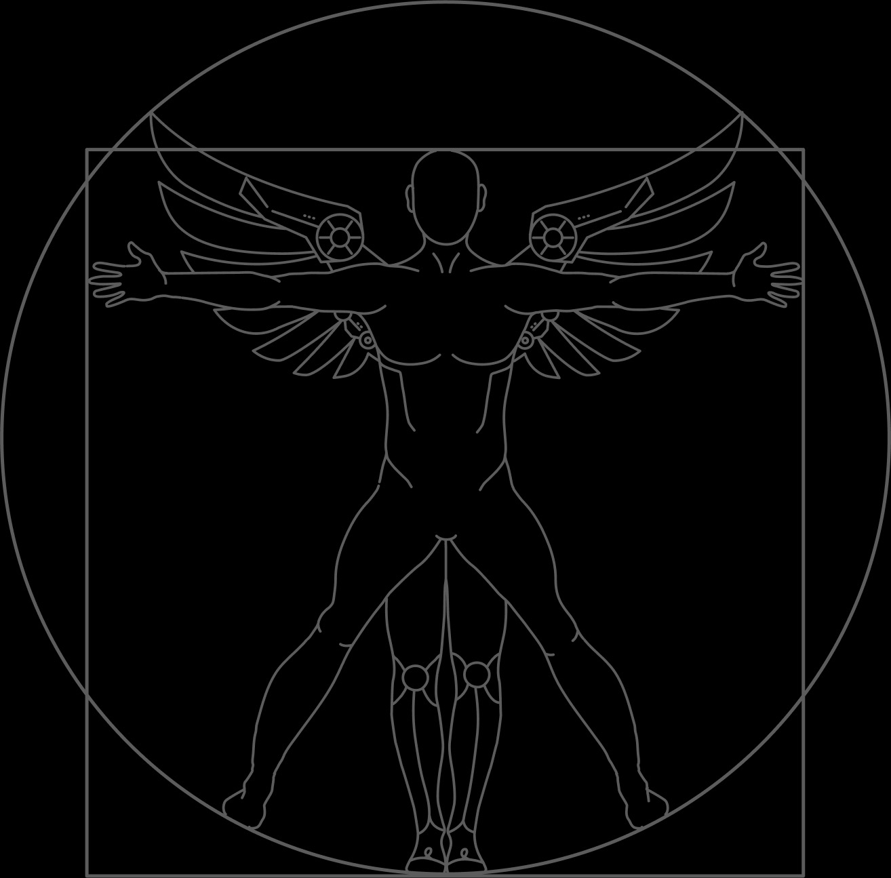

# The First Network for Humans and AI

**Introducing Autonomys**

Autonomys is the world’s first digital identity and financial network that is built for both Humans and AI, making it easy for anyone to safely participate in the emerging autonomous economy. The mission of Autonomys is to provide a global digital root of trust which all autonomous entities interacting online may leverage to help them distinguish between Humans and AI online, verify the authenticity and provenance of online content, delegate online access rights to AI assistants, send digital payments to one another, and collaborate more effectively at scale.

Autonomys primarily consists of two key primitives: Auto ID, a new digital identity standard that may be issued to both Humans and AI, and Auto Coin, the network's native token. Anyone can help secure the Autonomys network by using the Auto Peer app and earn Auto Coin in return. AI and Web developers may easily interact with the network using the Auto Kit developer SDK.

The Autonomys network is powered by the subspace blockchain protocol, a novel consensus mechanism that securely scales as the number of users grows, allowing the network to support the transaction needs of every Human and AI on the planet. Autonomys is based on several years of original research, initially funded by the US National Science Foundation (NSF). \

<figure><figcaption></figcaption></figure>

Autonomys is based on the idea of Humaic Intelligence (HI), a human-centric approach to AI safety that focuses on creating individually-aligned AI systems which can empower, extend, and enhance all human beings.&#x20;

Ultimately, Autonomys seeks to be a platform for humaic consensus, a system where humans, when paired with their AI companions, will be able to work together more effectively at scale, as AI will allow us to more easily unlock the _emergent_ collective super-intelligence of all humanity.

While similar to a project like Worldcoin on the surface, Autonomys is based on a very different set of core assumptions regarding the relationship between humanity, blockchains, and AI.

1. Worldcoin seeks to clearly separate humans and AI online through a biometric proof-of-personhood. We see this this as fundamentally impossible given the growing adoption of AI tools by humans, and our increasingly merged identities. Instead, we need a more holistic and composable blockchain-based identity solution that works for both Humans and AI.
2. Worldcoin seeks to use blockchain as tool for issuing Universal Basic Income (UBI) to humans in order to counteract the effects of AI driven job displacement. We believe that if AI is instead designed to amplify and complement human intelligence, rather than replace it, then blockchains can serve as economic infrastructure for Humans and AI working together.
3. Worldcoin does not address the key problem of AI alignment and safety, assuming that it will somehow be solved on its own or by others. We instead see blockchain technology as a key missing component in the AI safety debate and a critical platform for aligning both Artificial General Intelligence (AGI) and Artificial Super Intelligence (ASI), by providing guardrails.

<figure><figcaption>
The vision of Autonomys is to safely accelerate the world’s transition to the autonomous economy, a decentralized economy where all autonomous entities, be they natural humans or artificially intelligent systems, may trust, transact, and collaborate with one another. 
</figcaption></figure>

The vision of Autonomys is to safely accelerate the world’s transition to the autonomous economy, a decentralized economy where all autonomous entities, be they natural humans or artificially intelligent systems, may trust, transact, and collaborate with one another.&#x20;

This vision stands in stark contrast to Worldcoin, which instead seeks to accelerate the obsolescence of human beings and formalize their dependence on centralized companies like Open AI through a system of universal basic slavery.

The following dynamic whitepaper describes the reasoning behind the implementation of the Autonomys network as well as its current state and roadmap.

#### [Auto ID](../autonomys-solutions/autoid/)

To maintain online trust in the age of AI, we need a method for distinguishing between different kinds of _autonomous_ entities online. These include: natural entities, such as human beings and organizations; artificial entities, such as AI systems; or any combination thereof. Autonomous Identity (Auto ID) is our solution to this problem. Auto ID is a new form of digital identity, rooted in public key cryptography, that may be issued to both humans and AI. Auto ID is based on the Auto PKI, a decentralized form of Public Key Infrastructure (PKI) that anyone or anything may use to register and verify online identity.

Auto ID builds trust by allowing everyone to identify both AI and humans online, authenticate the content they produce, and authorize AI to act on their behalf. Unlike World ID, which may only be issued to humans through the Orb, a biometric scanning device, Auto ID may be issued to any autonomous entity via an online portal or API. Entities may then attach any cryptographic identity claim, such as a World ID, to their Auto ID, allowing them to _compose_ a proof-of-personhood.

#### [Auto Coin](../autonomys-solutions/autonomys-network/an-introduction-to-autocoin-and-autocash.md)

Auto Coin (ATC) is the native token of Autonomys. It is primarily used to pay the fees needed to process transactions on the network. Auto Coin has a capped supply of 21 billion coins under a deflationary emission schedule. New Auto Coin are issued directly to users who help secure the network with their free disk space. Any user may also stake their Auto Coin in order to earn a slice of transaction fees. Unlike Worldcoin, which may only be earned by those who physically register and receive a World ID, Auto Coin may be earned by anyone in the world with a home computer.

#### [Auto ](../autonomys-solutions/autokit/)<mark style="color:blue;">SDK</mark>

Auto SDK is a Software Development Kit that allows AI and Web developers to easily interact with the Autonomys Network through familiar programming languages like Python and Javascript, without needing to understand how blockchains or smart contracts work. It exposes simple APIs for issuing and verifying Auto IDs, as well as sending and accepting payments using Auto Coin.

#### [Auto Peer](../autonomys-solutions/autopeer/)

Auto Peer is a cross-platform desktop application that allows anyone to easily share free storage in order to earn Auto Coin and help secure the Autonomys Network. Every Auto Peer also receives an Auto ID and has the ability to stake their portfolio of Auto Coin to earn yield and provide liquidity to the network.
