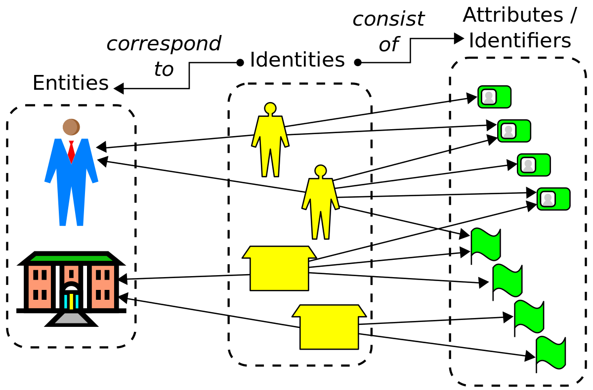

# DID & Verifiable Credentials

#### **Self-Sovereign Identity (SSI):**

Normally, when you want to prove who you are, you show an ID card or document that was issued by someone else, like the government or a company. This is called a "centralized identity" because those organizations are in control of your identity.

With self-sovereign identity, instead of getting your ID from someone else, you create your own "decentralized digital identity" on a registry such as a blockchain or distributed ledger. This identity is just for you - no one else controls or owns it.

You store information proving who you are, like your name, age, qualifications etc. in a digital wallet or repository on your phone or computer. This info is secured using advanced crypto techniques like public/private key pairs.

When you need to prove your identity to someone, like when renting an apartment, you can securely share just the required details from your digital wallet. You decide what to share and with who - giving you much more control over your personal data compared to traditional ID methods.

Self-sovereign identity aims to make identification more trustworthy, privacy-preserving and return ownership of your identity to you rather than organizations. Technical implementations including decentralized identifiers (DIDs), verifiable credentials, and zero-knowledge proofs are used to accomplish this vision.

<figure><figcaption></figcaption></figure>

#### Decentralized Identifiers

When you want to identify yourself online, you use things like a username, email address, or website URL. These are analogous to your "digital name".

But the problem is, these identities are provided and controlled by centralized companies or organizations. For example, Google owns your Gmail address.

Decentralized Identifiers or DIDs are a new type of digital identity that doesn't belong to any company. Instead of someone giving you an identity, with DIDs you create your own "self-sovereign" identity using special cryptography.

A DID looks something like this weird string: "did:example:123456789abcdefghi". It's generated using blockchain-like distributed ledger technology, rather than coming from a centralized source.

DIDs allow you to link Verifiable Credentials (VCs) containing verified claims about yourself like your name, age, qualifications etc. VCs are digital credentials that are cryptographically verified and linked to your DID.

Having your own DID means you remain in full control of your digital identity. It can't be taken away, censored, or turned off by anyone else. You're not locked into using a particular company's service or ecosystem either.

DIDs allow you to prove things about your identity in a trusted, decentralized way using advanced crypto like digital signatures and verifiable credentials. They help solve problems of identity and data ownership on the internet.

[https://www.w3.org/TR/did-core/](https://www.w3.org/TR/did-core/)

[https://www.w3.org/TR/vc-data-model-2.0/](https://www.w3.org/TR/vc-data-model-2.0/)

#### **Identity and Access Management (IAM)**

Imagine your house has many rooms and some rooms are off-limits or private. Identity and Access Management (IAM) is a system that controls who is allowed to enter which rooms and what they can do there.

In a company or organization, there are different users like employees, contractors, partners etc. IAM is how the company manages the identities of all these users through a centralized system.

First, IAM verifies the identity of each user through authentication techniques like passwords, biometrics, security tokens etc. This proves they are who they say they are.

Once authenticated, IAM then uses authorization processes to grant or deny the user access to specific resources like computer systems, data, applications based on their role or privileges within the organization.

An IAM system assigns roles and permissions to users. For example, regular employees may get access to basic resources, while IT admins get more powerful access capabilities.

Key IAM components include a central user directory, identity repositories, access management tools, password policies, and audit logging mechanisms to track who accessed what.

IAM helps securely manage user identities and access rights across the entire enterprise in one place according to policies and regulatory compliance requirements. This protects sensitive data and assets.

So in simple terms, IAM is the gatekeeper that controls digital entry and exit while maintaining proper identity assurances within an organizational environment.
