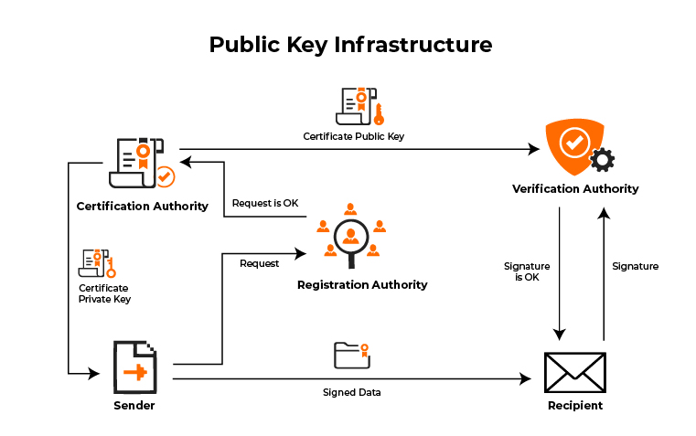

# Public Key Infrastructure

#### Public Key Infrastructure & Transport Layer Security

Public Key Infrastructure (PKI) is like a special club that websites need to join to prove they are legitimate and not trying to trick you. When a website wants to join the club, they get a membership card called a "digital certificate" from the club leader called a Certificate Authority (CA). This certificate has a secret code called a public key that only the real website knows.

When you visit a website, your web browser checks if they have a valid membership card or certificate from the club. If they do, it means you can trust and safely share private information with the website. It's like showing up to a friend's house and checking their ID to make sure they live there before going inside.

Transport Layer Security (TLS) is a secret code language that your computer and a website use when talking over the internet. It scrambles up your conversation into an encrypted message that bad people can't understand if they try to snoop. TLS uses those membership cards or certificates from PKI to make sure your computer is really talking to the correct website through a process called authentication.

It's like you and your friend making up a silly code language that only you two understand. That way, if someone tried to listen to your conversations, it would just sound like gibberish to them. Showing the PKI certificate proves you're talking to the right friend. The encrypted conversation using TLS is like the code language.

<figure><figcaption></figcaption></figure>

