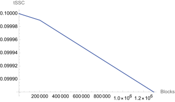

# Rewards & Fees

All the participants of the Autonomys Network are compensated for the work they do to keep the network live and secure. In this context, we define the following terms:

* **Fees**: The payments for transactions on the Autonomys Network.
* **Rewards**: The compensation for the work performed by the participants of the Autonomys Network via the issuance of the newly minted ATC by the protocol.

Different participants receive their compensation through a combination of the above based on their role.

#### Farmers

Currently, farmers receive:

* fees for the transactions and bundles they include in consensus chain blocks,
* block rewards for the blocks they proposed, issued by the protocol,
* vote rewards issued by the protocol.

#### Operators

Currently, operators are solely earning the fees for domain transactions they execute. Since domain transactions (e.g. EVM contract calls) are usually much more computationally heavy than those performed on the consensus chain (e.g. balance transfers), they are sufficiently expensive to compensate operators fairly for their work. The operators receive the reward for the executed transactions only after the corresponding domain block has cleared the challenge period. For more details, see [Domain Block Fees](decoupled-execution/domains/#domain-block-fees).

#### Nominators

Currently, nominators receive a portion of the fees of the operator they nominated, based on their shares in the operator pool. For more details on how the pool shares and fees are calculated, see [Nomination Pools](decoupled-execution/staking.md#nomination-pools).

### Dynamic Issuance

The issuance of the newly minted tokens by the protocol is dynamic and depends on the block height and the recent demand for blockspace.

On Gemini testnets, initially, farmers received exactly 0.1 tSSC for the block rewards for the blocks they proposed and 0.1 tSSC for votes they submitted. Autonomys implements a decay function, that will gradually reduce these rewards every block as the chain progresses. Over the long-term, the decrease follows the exponential decay:

$$
reference\_subsidy = initial\_subsidy * e^{-initial\_subsidy*(n-decay\_block\_start)/max\_issuance\_tokens}
$$

Both block proposer rewards and vote rewards are computed using the same formula.

This smooth reduction allows for higher rewards for early adopters, gradual increase of the circulating supply in a more controlled manner and an extended lifetime of issuance for the long-term viability of the chain.

Dynamic issuance was tested on the Gemini 3h testnet where $$initial\_subsidy = 0.1$$TSSC per block, $$n$$ is current block height, $$decay\_block\_start = 718959$$ is the block when the decay function was activated, and the $$max\_issuance\_tokens = 100000000 TSSC$$ is the total number of credits to be ever issued by the protocol for this reward.&#x20;

On Gemini-3h, the reference subsidy issuance is expected to decay following the curve below. For example, for the first 1,296,000 blocks (\~90 days) it starts at 0.1 TSSC per block and decreases as follows.

<figure><picture><source srcset="../.gitbook/assets/issuance-decay-dark.svg" media="(prefers-color-scheme: dark)"></picture><figcaption>
Dynamic Reward Issuance Gemini 3h
</figcaption></figure>

Apart from the reference subsidy issuance decay, the rewards for the block proposer are also dynamic based on the demand for blockspace. The subsidy presented above is a reference for the amount issued for an empty block. However, if the chain is seeing blockspace utilization, block proposers are also earning through transaction fees to cover their farming costs, and the protocol will lower the reward issued to the proposer. This allows the protocol to conserve tokens for later issuance in periods of lower demand.

The demand for blockspace is measured as an exponential moving average of the percentage of the maximum blockspace that is used by the normal transactions over the last 100 blocks, excluding operational transactions like votes and fraud proofs.

$$
blockspace\_utilization = \sum_{\mathclap{}}encoded\_transaction\_size / 3.75 MiB
$$

The final formula for the block proposer reward is:

$$proposer\_reward = reference\_subsidy - min(reference\_subsidy, max\_block\_fees) * blockspace\_utilization$$

For each block, the protocol decides whether the current cost of storage and demand are high enough to cover the proposer's costs of farming that block. It will slightly lower the issued reference subsidy if fees are not sufficient. If fees are high, the subsidy will be significantly lower.

The vote rewards are currently not affected by utilization and earn 90% of the reference subsidy:

$$voter\ reward = 0.9 * reference\_subsidy$$

The remaining 10% of each vote reward is given to the proposer of the block that includes the vote to incentivize the proposer to include votes.

### Transaction Fees

Each transaction on the Autonomys Network has a length and a weight. Length of a transaction is the number of bytes it consumes on the network. Weight of a transaction is the number of picoseconds it takes to execute it by a node with reference hardware. Autonomys Network separates the fees to be paid for a transaction into storage and compute fees. Storage fees are paid by the participants of the Autonomys Network for the storage space they consume for including the transaction in a block and eventually archiving it. Compute fees are paid for the computational resources they consume while executing the transaction.

Storage fee depends on the length of the transaction and the amount of available storage on the network. The formula for the storage fee is:

$$storage\ fee\ per\ byte = total\ credit\ supply/total\ space\ pledged/min\ replication\ factor-history\ size * (shannons/byte)$$

_storage fee(tx)=storage fee per byte∗length(tx) 𝑠ℎ𝑎𝑛𝑛𝑜𝑛𝑠_

For the purposes of storage fee calculation, the total Auto Coin supply consists of all ATC in existence including staked or otherwise locked. The total space pledged to the network is divided by the protocol's minimum replication factor of 50, which ensures that the network is able to reliably store all the transactions that are included in the consensus chain. The history size is the total size of all the blocks in the consensus chain that are archived.

Compute fee depends on the weight of the transaction and the demand on the network. Compute fees for the execution of extrinsics on the consensus chain (e.g., balance transfers) are collected by the block proposer. Compute fees for executing transaction bundles on domains are paid to the domain operators who submit the Execution Receipt (ER) containing this bundle (split equally between all operators who submit this ER) after the ER has cleared the challenge period. Autonomys implements Polkadot’s [slow adjusting fee](https://research.web3.foundation/Polkadot/overview/token-economics#2-slow-adjusting-mechanism) mechanism. The fee is slightly adjusted every block based on utilization of available block weight by normal extrinsics.

The formula for the compute fee is:

$$compute\ fee(tx) = adjustment\ multiplier * compute\ fee\ per\ weight * weight(tx)\ shannons$$
